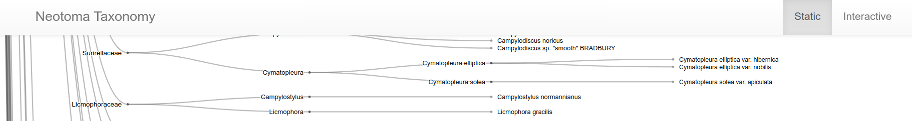

<!-- badges: start -->

[](https://www.tidyverse.org/lifecycle/#stable)

[](https://nsf.gov/awardsearch/showAward?AWD_ID=1550707) [](https://nsf.gov/awardsearch/showAward?AWD_ID=1541002)

[](https://doi.org/10.5281/zenodo.10139967)

<!-- badges: end -->

# Neotoma Taxonomy Viewer

This repository is intended to act as a graphical viewer for the Neotoma Paleoecology Database's taxonomy table. The basis of this repository is work by [Scott Farley](https://www.scottsfarley.com/) who built a set of three linked visualizations for Neotoma's taxa, served using [D3.js](https://d3js.org/) visualizations through HTML webpages.

Subsequent modifications have been made to use new Neotoma APIs for site and sample queries, and to link data to additional information within Neotoma.

## Contributors

This project is an open project however it is subject to the license of the [original GitHub project](https://github.com/scottsfarley93/neotomataxonomy). All contributors to Neotoma Paleoecology Database project are bound by a [code of conduct](CODE_OF_CONDUCT.md).  Please review and follow this code of conduct as part of your contribution.

* [](https://orcid.org/0000-0003-1952-3883) [Scott Farley](https://www.scottsfarley.com/)
* [](https://orcid.org/0000-0002-2700-4605) [Simon Goring](http://goring.org)

### Tips for Contributing

Issues and bug reports are always welcome.  Code clean-up, and feature additions can be done either through pull requests to [project forks](https://github.com/NeotomaDB/neotomataxonomy/network/members) or [project branches](https://github.com/NeotomaDB/neotomataxonomy/branches).

All products of the Neotoma Paleoecology Database are licensed under an [MIT License](LICENSE) unless otherwise noted.

## How to Run

This repository uses a set of static HTML pages to serve the taxonomic visualization which can be accessed directly with your browser by opening the pages.

It is possible to view the pages using GitHub Pages with the following links:

* [Radial Plot](http://open.neotomadb.org/neotomataxonomy/radial.html)
* [Dendrogram](http://open.neotomadb.org/neotomataxonomy/dendro.html)

### Generating Data

The data is generated using a Python v3.11 script ([csv_to_nested.py](utils/csv_to_nested.py)) that calls out to Neotoma's taxonomy table using the [Neotoma API](https://api.neotomadb.org). The updated script replaces the old v1.0 API calls and improves script efficiency. At the same time, cleaning up the repository has removed additional functionality in an effort to simplify the purpose and structure of the repository.

To build the needed data files:

```bash
> python3.11 utils/csv_to_nested.csv
```

This calls the Neotoma API for each individual taxon to get a count of the number of sites each taxon is present at. Because this represents tens of thousand of individual API calls this takes some time to run. This may be parallelized using a library like `joblib` to speed up data processing. It is also possible that we might choose to restructure the Neotoma API to speed up the calls.
